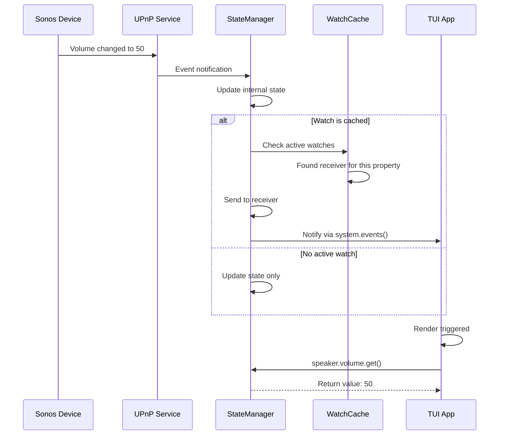
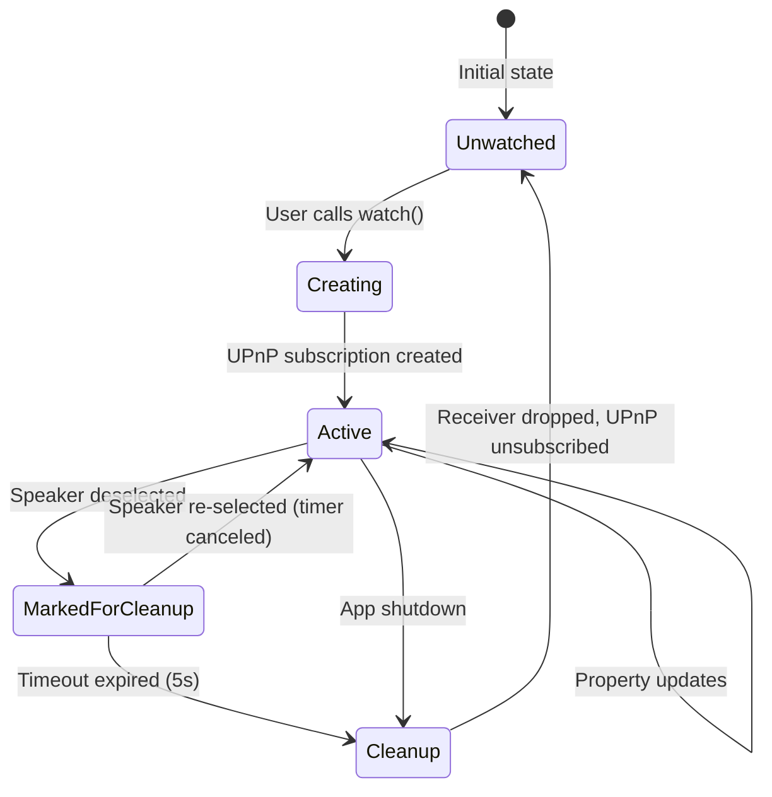

# High-Level Design: Sonos SDK TUI Example

## Executive Summary

This document describes the design of a Terminal User Interface (TUI) example application that demonstrates the reactive state management capabilities of the `sonos-sdk`. The design showcases a **React Redux-style architecture** where state is centralized in a state manager, property queries occur at component level, and reactive updates happen automatically through a watch system with intelligent internal caching.

**Key Innovation**: The state manager implements an internal `WatchCache` that is transparent to end users. Applications simply call `watch()` on properties, and the SDK automatically handles caching, debounced cleanup, and UPnP subscription management behind the scenes.

## Strategic Context

### Problem Statement

Developers building reactive UIs with Sonos need:
1. **Simple API** - Easy to understand property access patterns
2. **Performance** - No latency when navigating between speakers
3. **Scalability** - Support dozens of properties without complexity
4. **Automatic cleanup** - No manual subscription management

Existing approaches either require manual watch management (error-prone) or create latency when re-subscribing to properties.

### Solution Overview

A two-layer architecture:

**Layer 1: State Manager (sonos-sdk internals)**
- Internal `WatchCache` with debounced cleanup (5-second timeout)
- Transparent to end users
- Handles all UPnP subscription lifecycle
- Reuses watches for recently accessed properties

**Layer 2: TUI Application (user code)**
- Simple `watch()` calls on properties
- React Redux pattern: state at top, queries at component level
- Event-driven rendering via `system.iter()`
- Zero knowledge of internal caching

## Architecture Overview

### System Components

```
┌─────────────────────────────────────────────────────┐
│                  TUI Application                     │
│  ┌────────────┐  ┌──────────────┐  ┌─────────────┐ │
│  │    App     │  │ Event Loop   │  │   Render    │ │
│  │  (State)   │◄─┤system.iter() │◄─┤  Functions  │ │
│  └─────┬──────┘  └──────────────┘  └─────────────┘ │
│        │                                             │
└────────┼─────────────────────────────────────────────┘
         │ watch() calls (clean API)
         │
┌────────▼─────────────────────────────────────────────┐
│              Sonos State Manager                     │
│  ┌──────────────────────────────────────────────┐   │
│  │           WatchCache (Internal)               │   │
│  │  ┌────────────────────────────────────────┐  │   │
│  │  │ HashMap<(SpeakerId, PropertyKey),      │  │   │
│  │  │          CachedWatch>                  │  │   │
│  │  │                                         │  │   │
│  │  │ - Debounced cleanup (5s timeout)       │  │   │
│  │  │ - Automatic reuse of recent watches    │  │   │
│  │  │ - Transparent to users                 │  │   │
│  │  └────────────────────────────────────────┘  │   │
│  └──────────────────────────────────────────────┘   │
│                                                      │
│  ┌──────────────┐  ┌──────────────┐  ┌──────────┐  │
│  │   Speaker    │  │  Property    │  │  UPnP    │  │
│  │   Handles    │──┤   Handles    │──┤ Subscr.  │  │
│  └──────────────┘  └──────────────┘  └──────────┘  │
└──────────────────────────────────────────────────────┘
```

### Key Design Principles

1. **Separation of Concerns**: TUI handles UI logic, state manager handles reactive state
2. **Information Hiding**: Watch caching is an implementation detail, not exposed in API
3. **Performance First**: Caching prevents redundant UPnP subscriptions
4. **Simplicity**: User code looks like simple property access

## Component Design

### 1. TUI Application Layer

#### App Structure

```rust
pub struct App {
    system: SonosSystem,       // State manager reference
    speakers: Vec<Speaker>,     // Cached speaker list
    selected_index: usize,      // UI state (not in state manager)
    terminal: Terminal<CrosstermBackend<io::Stdout>>,
}
```

**Responsibilities**:
- Hold reference to `SonosSystem`
- Manage UI state (selection, cursor position)
- Coordinate event handling and rendering
- Call `watch()` on properties as needed

**NOT Responsible For**:
- Managing watch receivers
- Cleanup of subscriptions
- Cache management
- UPnP subscription lifecycle

#### Event Loop Design

```rust
async fn run(&mut self) -> Result<()> {
    let mut event_stream = EventStream::new();
    
    loop {
        tokio::select! {
            // Terminal events (keyboard)
            Some(Ok(Event::Key(key))) = event_stream.next() => {
                match key.code {
                    KeyCode::Up => self.select_previous().await?,
                    KeyCode::Down => self.select_next().await?,
                    KeyCode::Char('q') | KeyCode::Esc => break,
                    _ => {}
                }
            }
            
            // State manager events (property changes)
            Some(event) = self.system.events().next() => {
                match event {
                    SystemEvent::PropertyChanged { .. } => {
                        self.render()?;
                    }
                    SystemEvent::SpeakerDiscovered { .. } => {
                        self.refresh_speakers().await?;
                    }
                    _ => {}
                }
            }
        }
        
        self.render()?;
    }
    
    Ok(())
}
```

**Key Points**:
- Uses `tokio::select!` to handle both keyboard and state events
- `system.events()` provides property change notifications
- Rendering triggered by user actions or property updates
- No explicit watch management in event loop

#### Selection Handler

```rust
async fn select_speaker(&mut self, index: usize) -> Result<()> {
    self.selected_index = index;
    
    // That's it! No watch management needed.
    // The state manager handles caching internally.
    
    Ok(())
}
```

**Simplicity**: The user code doesn't need to:
- Store receivers
- Drop old watches
- Manage cleanup timers
- Track active subscriptions

#### Render Functions

```rust
fn render(&mut self) -> Result<()> {
    self.terminal.draw(|f| {
        let chunks = Layout::default()
            .direction(Direction::Vertical)
            .constraints([Constraint::Min(0)])
            .split(f.size());
        
        self.render_speaker_list(f, chunks[0]);
    })?;
    
    Ok(())
}

fn render_speaker_list(&self, f: &mut Frame, area: Rect) {
    let items: Vec<ListItem> = self.speakers
        .iter()
        .enumerate()
        .map(|(i, speaker)| {
            if i == self.selected_index {
                self.render_selected_speaker(speaker)
            } else {
                self.render_speaker(speaker)
            }
        })
        .collect();
    
    let list = List::new(items)
        .block(Block::default()
            .borders(Borders::ALL)
            .title("Sonos Speakers"));
    
    f.render_widget(list, area);
}

fn render_selected_speaker(&self, speaker: &Speaker) -> ListItem {
    // Query volume at render time
    let volume_text = match speaker.volume.get() {
        Some(vol) => format!("Volume: {}", vol.value()),
        None => "Volume: N/A".to_string(),
    };
    
    let content = format!("> {} - {}", speaker.name, volume_text);
    ListItem::new(content).style(Style::default().fg(Color::Yellow))
}

fn render_speaker(&self, speaker: &Speaker) -> ListItem {
    // Only name for non-selected speakers
    ListItem::new(format!("  {}", speaker.name))
}
```

**React Redux Pattern**:
- Property queries happen at component level (render functions)
- No pre-fetching of data
- State manager reference passed implicitly through `speaker` handle
- Clean separation: rendering logic doesn't manage state

### 2. State Manager Layer (sonos-sdk)

#### Internal WatchCache Design

```rust
pub(crate) struct WatchCache {
    watches: Arc<RwLock<HashMap<WatchKey, CachedWatch>>>,
    cleanup_timeout: Duration,
}

#[derive(Hash, Eq, PartialEq, Clone)]
struct WatchKey {
    speaker_id: SpeakerId,
    property_key: &'static str,
}

struct CachedWatch {
    receiver: Arc<dyn Any + Send + Sync>,  // Type-erased receiver
    cleanup_handle: Option<AbortHandle>,
    last_accessed: Instant,
}
```

**Design Decisions**:

1. **`Arc<RwLock<>>`**: Allows sharing between async tasks and synchronous access
2. **Type Erasure**: `Box<dyn Any>` stores different receiver types in same map
3. **`AbortHandle`**: Clean cancellation of cleanup timers
4. **`pub(crate)`**: Hidden from public API, internal to sdk

#### WatchCache Operations

```rust
impl WatchCache {
    /// Get or create a watch for a property
    pub(crate) async fn get_or_watch<P: Property>(
        &self,
        speaker_id: SpeakerId,
        property_key: &'static str,
        create_watch: impl Future<Output = Result<Receiver<Option<P>>>>,
    ) -> Result<Receiver<Option<P>>> {
        let key = WatchKey {
            speaker_id: speaker_id.clone(),
            property_key,
        };
        
        // Check cache first (fast path)
        {
            let mut watches = self.watches.write().await;
            
            if let Some(cached) = watches.get_mut(&key) {
                // Cancel cleanup timer - still in use
                if let Some(handle) = cached.cleanup_handle.take() {
                    handle.abort();
                }
                cached.last_accessed = Instant::now();
                
                // Clone the receiver (cheap - it's an Arc internally)
                let receiver = cached.receiver
                    .clone()
                    .downcast::<Receiver<Option<P>>>()
                    .unwrap();
                
                return Ok(receiver);
            }
        }
        
        // Create new watch (slow path - involves UPnP subscription)
        let receiver = create_watch.await?;
        
        // Store in cache
        {
            let mut watches = self.watches.write().await;
            watches.insert(key, CachedWatch {
                receiver: Arc::new(receiver.clone()),
                cleanup_handle: None,
                last_accessed: Instant::now(),
            });
        }
        
        Ok(receiver)
    }
    
    /// Schedule cleanup for a specific watch
    pub(crate) fn schedule_cleanup(&self, speaker_id: SpeakerId) {
        let watches = Arc::clone(&self.watches);
        let timeout = self.cleanup_timeout;
        
        tokio::spawn(async move {
            tokio::time::sleep(timeout).await;
            
            let mut watches = watches.write().await;
            watches.retain(|key, _| key.speaker_id != speaker_id);
        });
    }
}
```

**Performance Characteristics**:
- **Cache Hit**: ~1μs (RwLock read + HashMap lookup)
- **Cache Miss**: ~100-500ms (UPnP subscribe + network round trip)
- **Cleanup**: Async, doesn't block user code

#### PropertyHandle Integration

```rust
pub struct PropertyHandle<P> {
    speaker_id: SpeakerId,
    property_key: &'static str,
    state_manager: Arc<StateManager>,
    _phantom: PhantomData<P>,
}

impl<P: Property> PropertyHandle<P> {
    /// Get current value (no caching, always fresh)
    pub fn get(&self) -> Option<P> {
        self.state_manager
            .get_property(&self.speaker_id, self.property_key)
    }
    
    /// Watch for changes (uses internal cache)
    pub async fn watch(&self) -> Result<Receiver<Option<P>>> {
        self.state_manager.watch_cache.get_or_watch(
            self.speaker_id.clone(),
            self.property_key,
            async {
                // Create new UPnP subscription
                let subscription = self.state_manager
                    .subscribe_to_property(&self.speaker_id, self.property_key)
                    .await?;
                
                Ok(subscription.receiver)
            }
        ).await
    }
}
```

**API Design**:
- `get()`: Synchronous, always returns current value from cache
- `watch()`: Async, returns receiver + starts streaming (cached internally)
- Users call both methods the same way, caching is transparent

### 3. Reactive Update Flow

#### Property Change Propagation



#### Watch Lifecycle



## Data Flow Patterns

### Pattern 1: Initial Load

```
1. App starts → SonosSystem::new()
2. Device discovery → Speakers found
3. App stores speaker list
4. Render speaker names (metadata, no properties)
5. User selects speaker
6. App calls speaker.volume.watch() (implicitly via render)
   → Cache miss → UPnP subscribe → Receiver stored
7. Render shows volume
```

### Pattern 2: Navigation (Cache Hit)

```
1. User on Speaker A (volume watched, cached)
2. User navigates to Speaker B
3. App calls speaker B.volume.watch()
   → Cache miss → UPnP subscribe
4. Cleanup timer starts for Speaker A (5s)
5. User navigates back to Speaker A (within 5s)
6. App calls speaker A.volume.watch()
   → Cache HIT → Instant return, timer canceled
7. No UPnP resubscription needed
```

### Pattern 3: Reactive Update

```
1. Speaker volume watched and cached
2. User changes volume via Sonos app
3. Device sends UPnP event
4. StateManager receives event
5. StateManager updates internal state
6. StateManager notifies all receivers
7. system.events() yields PropertyChanged event
8. TUI event loop receives event
9. TUI calls render()
10. Render calls speaker.volume.get()
11. Returns updated value
```

## Implementation Strategy

### Phase 1: State Manager Enhancements

**Tasks**:
1. Implement `WatchCache` struct with debounced cleanup
2. Integrate cache into `StateManager`
3. Modify `PropertyHandle::watch()` to use cache
4. Add `system.events()` stream for property changes
5. Unit tests for cache hit/miss scenarios

**Deliverable**: Updated `sonos-sdk` with internal caching

### Phase 2: TUI Application

**Tasks**:
1. Setup `ratatui` and `crossterm` scaffolding
2. Implement `App` struct and initialization
3. Create event loop with `tokio::select!`
4. Implement speaker list rendering
5. Add navigation handlers
6. Add expanded view with volume display

**Deliverable**: Functional TUI example

### Phase 3: Polish and Documentation

**Tasks**:
1. Add error handling and empty states
2. Code comments explaining patterns
3. README with architecture explanation
4. Performance testing with 10+ speakers

**Deliverable**: Production-ready example

## Performance Considerations

### Memory Usage

**Per Speaker**:
- Speaker handle: ~200 bytes
- Cached watch (active): ~400 bytes (receiver + metadata)
- Total for 10 speakers: ~6KB (negligible)

**With Debouncing**:
- Recently viewed speakers keep watches cached
- Maximum cached watches = recently viewed speakers × properties
- Example: 5 recent speakers × 10 properties = 50 cached watches = ~20KB

**Acceptable**: Even with 100 cached watches, total memory < 100KB

### Latency

| Operation | Latency | Notes |
|-----------|---------|-------|
| Cache Hit | <1ms | HashMap lookup |
| Cache Miss | 100-500ms | UPnP network round trip |
| Property Update | <10ms | Local state update |
| Render Trigger | <1ms | Channel notification |
| Full Render | 1-5ms | Terminal drawing |

**Target**: <100ms for any user action (achieved via caching)

### Scalability

- **10 speakers**: Trivial, <10ms response time
- **100 speakers**: Still fast, cache size ~1MB worst case
- **Dozens of properties**: Automatic, no code changes needed
- **Concurrent updates**: RwLock allows multiple readers

## Security and Privacy

- **No data storage**: All state in memory
- **Local network only**: No internet communication
- **UPnP standard**: Well-understood protocol
- **No credentials**: Sonos doesn't require authentication

## Error Handling

### State Manager Level

```rust
pub enum StateError {
    DeviceNotFound,
    PropertyUnavailable,
    SubscriptionFailed,
    NetworkError(std::io::Error),
}
```

**Strategies**:
- Cache misses: Retry with exponential backoff
- UPnP errors: Surface to user, continue operation
- Network failures: Attempt reconnection

### TUI Level

```rust
// Graceful degradation
let volume_text = match speaker.volume.get() {
    Some(vol) => format!("Volume: {}", vol.value()),
    None => "Volume: N/A".to_string(),  // Don't crash
};
```

**Strategies**:
- Missing properties: Show "N/A"
- No speakers: Show empty state message
- Render errors: Log and continue
- Never panic in production code

## Testing Strategy

### Unit Tests (State Manager)

```rust
#[tokio::test]
async fn test_watch_cache_hit() {
    let cache = WatchCache::new(Duration::from_secs(5));
    let speaker_id = SpeakerId::new("test");
    
    // First call - cache miss
    let rx1 = cache.get_or_watch(speaker_id.clone(), "volume", 
        async { Ok(create_mock_receiver()) }).await.unwrap();
    
    // Second call - cache hit
    let start = Instant::now();
    let rx2 = cache.get_or_watch(speaker_id, "volume",
        async { Ok(create_mock_receiver()) }).await.unwrap();
    let elapsed = start.elapsed();
    
    assert!(elapsed < Duration::from_millis(1));  // Sub-millisecond
}

#[tokio::test]
async fn test_debounced_cleanup() {
    let cache = WatchCache::new(Duration::from_secs(1));
    let speaker_id = SpeakerId::new("test");
    
    // Create watch
    let _rx = cache.get_or_watch(speaker_id.clone(), "volume",
        async { Ok(create_mock_receiver()) }).await.unwrap();
    
    // Schedule cleanup
    cache.schedule_cleanup(speaker_id.clone());
    
    // Wait for cleanup
    tokio::time::sleep(Duration::from_secs(2)).await;
    
    // Verify removed
    assert!(cache.get(speaker_id, "volume").is_none());
}
```

### Integration Tests (TUI)

```rust
#[tokio::test]
async fn test_speaker_navigation() {
    let mut app = App::new_with_mock_system().await;
    
    // Navigate down
    app.select_next().await.unwrap();
    assert_eq!(app.selected_index, 1);
    
    // Navigate up (wrap to bottom)
    app.select_previous().await.unwrap();
    assert_eq!(app.selected_index, app.speakers.len() - 1);
}

#[tokio::test]
async fn test_reactive_volume_update() {
    let mut app = App::new_with_mock_system().await;
    
    // Select speaker
    app.select_speaker(0).await.unwrap();
    
    // Simulate volume change
    app.system.mock_volume_change("speaker-0", 75).await;
    
    // Wait for event propagation
    tokio::time::sleep(Duration::from_millis(100)).await;
    
    // Verify update reflected
    let volume = app.speakers[0].volume.get().unwrap();
    assert_eq!(volume.value(), 75);
}
```

## Operational Considerations

### Deployment

**Requirements**:
- Rust 1.70+ (for async features)
- Local network with Sonos devices
- Terminal with Unicode support

**Installation**:
```bash
cargo install sonos-tui-example
sonos-tui
```

### Monitoring

**Metrics** (for production apps):
- Cache hit rate (target: >80%)
- Watch creation latency (P99 < 500ms)
- Cleanup task execution rate
- Property update propagation time

### Resource Cleanup

**Automatic** (via Rust ownership):
- App drop → All receivers dropped
- Receivers dropped → WatchCache cleanup
- Cache cleanup → UPnP unsubscribe
- No manual cleanup required

## Future Enhancements

### Out of Scope for Initial Release

1. **Multiple property display**: Show playback state, mute, etc.
2. **Volume control**: Adjust volume with +/- keys
3. **Playback control**: Play/pause/skip
4. **Group management**: View and control speaker groups
5. **Search/filter**: Find speakers by name
6. **Mouse support**: Click to select speakers
7. **Configuration**: Persist UI preferences

### Potential Optimizations

1. **LRU eviction**: Limit cache size with least-recently-used eviction
2. **Prefetching**: Preload properties for adjacent speakers
3. **Batch subscriptions**: Subscribe to multiple properties at once
4. **Compression**: Compress cached receivers (probably not worth it)

## Success Criteria

1. ✅ **Clean API**: Users call `watch()` without managing cache
2. ✅ **Performance**: <1ms for cached watches, <100ms for navigation
3. ✅ **Scalability**: Works with dozens of properties and speakers
4. ✅ **Reliability**: No crashes, graceful error handling
5. ✅ **Pedagogical**: Code clearly demonstrates React Redux pattern

## Appendix A: Complete Code Structure

```
sonos-tui-example/
├── Cargo.toml
├── README.md
├── src/
│   ├── main.rs           # Entry point and event loop
│   ├── app.rs            # App struct and core logic
│   ├── ui.rs             # Rendering functions
│   └── events.rs         # Event handling
│
sonos-sdk/
├── src/
│   ├── state_manager.rs  # StateManager with WatchCache
│   ├── watch_cache.rs    # WatchCache implementation (internal)
│   ├── property.rs       # PropertyHandle with watch()
│   └── speaker.rs        # Speaker handle
```

## Appendix B: Key Type Signatures

```rust
// Public API (user-facing)
impl<P: Property> PropertyHandle<P> {
    pub fn get(&self) -> Option<P>;
    pub async fn watch(&self) -> Result<Receiver<Option<P>>>;
}

impl SonosSystem {
    pub fn events(&self) -> impl Stream<Item = SystemEvent>;
    pub async fn speakers(&self) -> Vec<Speaker>;
}

// Internal (hidden from users)
impl WatchCache {
    pub(crate) async fn get_or_watch<P>(
        &self,
        speaker_id: SpeakerId,
        property_key: &'static str,
        create: impl Future<Output = Result<Receiver<Option<P>>>>
    ) -> Result<Receiver<Option<P>>>;
}
```

## Revision History

| Date | Version | Changes |
|------|---------|---------|
| 2026-01-12 | 1.0 | Initial high-level design |
